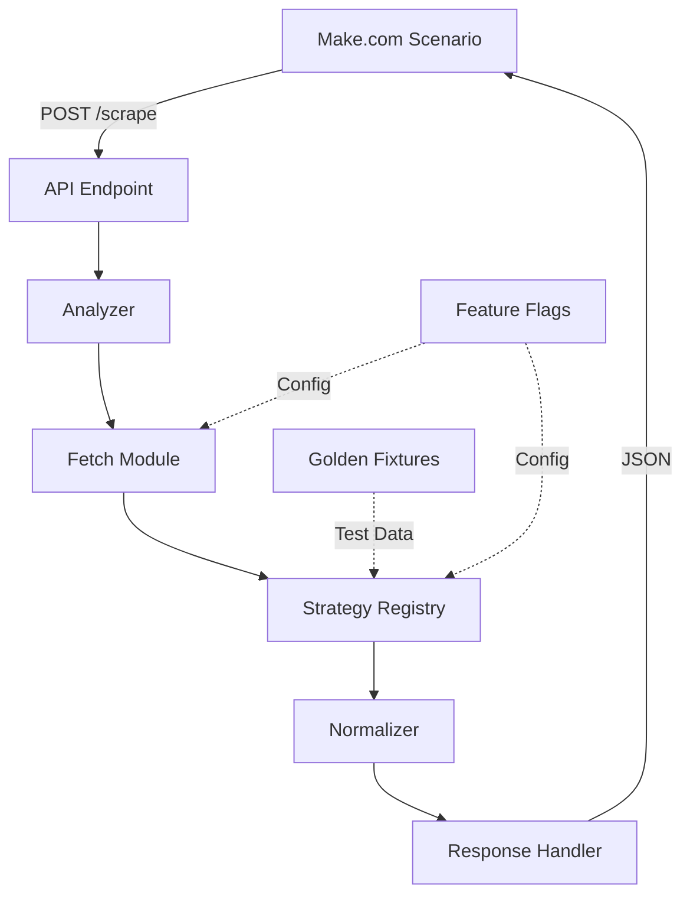
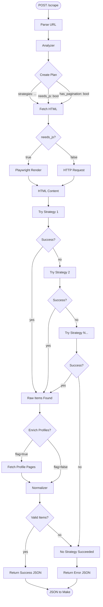
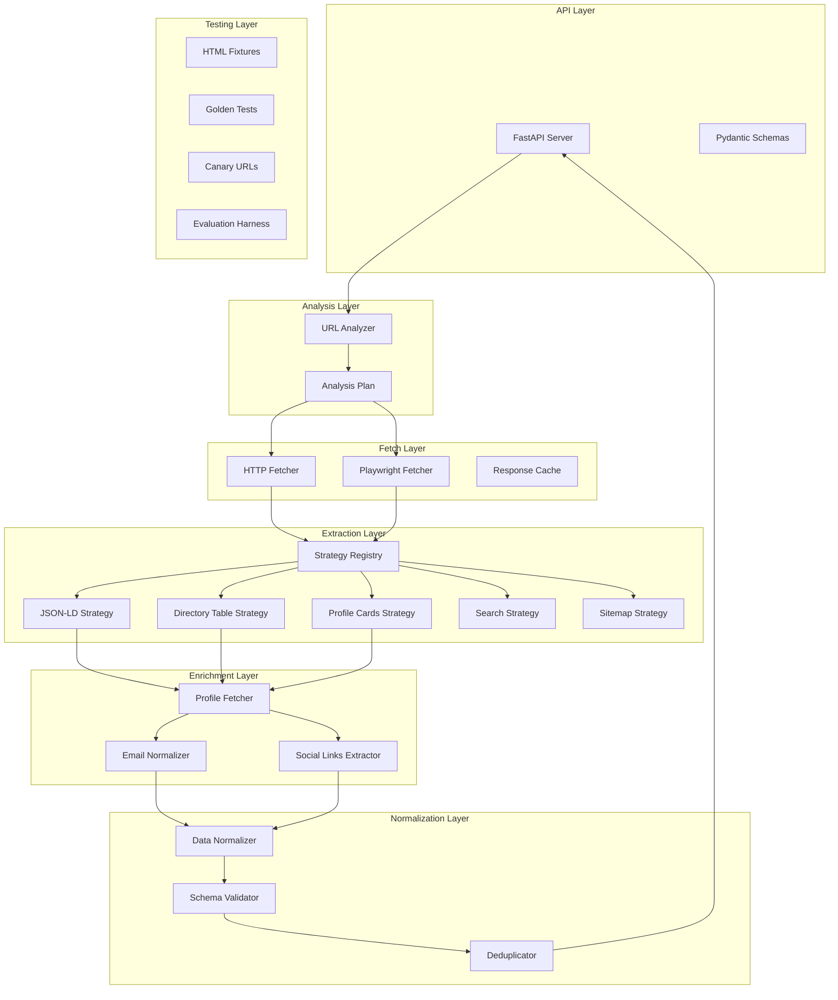
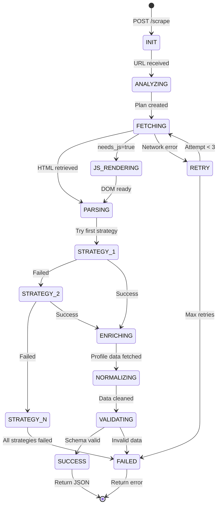

# Scraping Agent #1 - Visual Map & Architecture

## System Overview

**Goal**: Extract university music faculty directory information with 90%+ accuracy across diverse website structures.

**Input**: Faculty directory URL  
**Output**: Structured JSON with faculty names, titles, emails, profile URLs, social links, bio snippets  
**Integration**: Make.com scenario → Google Sheets

---

## High-Level Component Flow



---

## Detailed Pipeline Flow



---

## Component Architecture



---

## State Machine (Job Lifecycle)



---

## Decision Tables

### Strategy Selection Logic

| URL Pattern | JSON-LD Present | Table Detected | Cards Detected | JS Required | Strategy Order |
|-------------|-----------------|----------------|----------------|-------------|----------------|
| /faculty | ✅ | ❌ | ❌ | ❌ | [json_ld, table, cards] |
| /faculty | ❌ | ✅ | ❌ | ❌ | [table, json_ld, cards] |
| /directory | ❌ | ❌ | ✅ | ❌ | [cards, table, json_ld] |
| /people | ❌ | ❌ | ❌ | ✅ | [js_render → retry above] |

### Email Status Classification

| Email Found | Location | Obfuscated | Status |
|-------------|----------|------------|--------|
| ✅ | Directory | ❌ | "present" |
| ✅ | Profile Page | ❌ | "found_on_profile" |
| ✅ | Directory/Profile | ✅ | "obfuscated_resolved" |
| ❌ | Directory | N/A | "missing" |
| ❌ | Both | N/A | "not_listed" |
| ? | Directory/Profile | ✅ | "obfuscated_unresolved" |

### Feature Flag Logic

| Flag | Default | When Enabled | Performance Impact |
|------|---------|--------------|-------------------|
| ENRICH_PROFILES | false | Missing emails on directory | High (2x requests) |
| ENABLE_JS_RENDER | false | Empty content detected | Very High (10x slower) |
| ENABLE_PAGINATION | true | Multi-page directories | Medium |
| RESPECT_ROBOTS | true | Always | Low |
| MAX_PAGES | 5 | Pagination enabled | Linear with pages |

---

## Component Specifications

### 1. Analyzer (`analyze/plan.py`)
**Input**: URL string  
**Output**: AnalysisPlan dict  
**Function**: Examine URL patterns and make initial strategy recommendations  

```python
{
  "url": str,
  "strategies": List[str],  # Ordered by confidence
  "needs_js": bool,
  "has_pagination": bool,
  "pagination": {"mode": str, "selector": str, "max_pages": int},
  "hints": {"faculty_keywords": List[str], "search_path": str}
}
```

**Errors**: None (always returns a plan, even if basic)

### 2. Fetch (`fetch/http.py`, `fetch/browser.py`)
**Input**: URL, AnalysisPlan  
**Output**: HTML string, fetch_notes  
**Function**: Retrieve page content via HTTP or headless browser  

**Errors**: NetworkError, TimeoutError, BotBlockedError

### 3. Strategy Registry (`extract/strategies/`)
**Input**: HTML string, base_url  
**Output**: List[RawLead]  
**Function**: Extract structured data using specific parsing logic  

```python
RawLead = {
  "name": str,
  "title": str,
  "email_raw": str,  # May be obfuscated
  "profile_url": str,
  "directory_url": str,
  "socials": List[str],
  "bio_snippet": str,
  "diagnostics": {"source_strategy": str, "confidence": float}
}
```

**Errors**: ParseError, NoMatchError (handled gracefully)

### 4. Normalizer (`normalize/normalize.py`)
**Input**: List[RawLead], directory_url  
**Output**: List[NormalizedLead]  
**Function**: Clean data, resolve obfuscation, standardize formats  

```python
NormalizedLead = {
  "name": str,
  "title": str,  
  "email": str,  # Clean or empty
  "email_status": Enum,
  "profile_url": str,
  "socials": List[str],
  "bio_snippet": str
}
```

---

## Fixture Strategy

### Capture Points (When to Save Fixtures)

1. **After first successful extraction** from any strategy
   - Save: `fixtures/uni_{name}.html` + `uni_{name}.expected.json`
   - Test: Golden test that exact output is reproduced

2. **After pagination works** on any site
   - Save: `fixtures/uni_{name}_page1.html` + `uni_{name}_page2.html`
   - Test: Combined item count meets expectation

3. **After JS rendering works** on any site
   - Save: `fixtures/uni_{name}_rendered.html` (post-JS content)
   - Test: Strategy works on static saved content

4. **After email obfuscation resolved**
   - Save: `fixtures/obfuscated_emails.html` (patterns found)
   - Test: Normalizer correctly resolves each pattern

5. **Negative cases**
   - Save: `fixtures/not_a_directory.html` (should return ok=false)
   - Save: `fixtures/empty_directory.html` (should return empty items)

### Fixture Organization

```
fixtures/
├── success/
│   ├── uni_a_jsonld.html + .expected.json
│   ├── uni_b_table.html + .expected.json  
│   └── uni_c_cards.html + .expected.json
├── pagination/
│   ├── uni_multi_page1.html + page2.html + .expected.json
├── javascript/
│   ├── uni_spa_rendered.html + .expected.json
├── obfuscation/
│   ├── emails_obfuscated.html + .expected.json
└── negative/
    ├── not_faculty_page.html + .expected.json
    └── empty_results.html + .expected.json
```

---

## Potential Loop Traps & Solutions

### 🔴 Loop Trap: Strategy Interference
**Problem**: Improving table strategy breaks JSON-LD sites  
**Solution**: Every change runs `pytest fixtures/` first; failures block the change  
**Prevention**: Isolated strategy files; shared code in utilities only

### 🔴 Loop Trap: Perfectionist Parsing  
**Problem**: Spending hours on one weird site's edge case  
**Solution**: 45-minute timeboxes; capture what you learned; move to next site  
**Prevention**: Evaluation harness shows overall % progress

### 🔴 Loop Trap: Schema Churn
**Problem**: Keep changing JSON output format; breaks Make integration  
**Solution**: Lock schema early; treat as API contract; version if needed  
**Prevention**: Schema validation in tests

### 🔴 Loop Trap: Feature Creep
**Problem**: Adding social media, photos, course listings, etc.  
**Solution**: Stick to core fields: name, title, email, profile_url only  
**Prevention**: Clear acceptance criteria per phase

### 🔴 Loop Trap: Over-Engineering Early
**Problem**: Building ML classifiers, complex NLP, distributed crawling  
**Solution**: Start with simple heuristics; upgrade only when needed  
**Prevention**: "Simplest thing that works" mindset

---

## Build Checklist

### Phase 0: Foundation ✅/❌
- [ ] Create Replit project structure
- [ ] Install dependencies (FastAPI, BeautifulSoup, Playwright, etc.)
- [ ] Set up schemas (`normalized_lead.json`, `error_envelope.json`)
- [ ] Create basic API server (`api/server.py`)
- [ ] Test endpoint returns stable JSON structure
- [ ] Set up test framework (`pytest`)
- [ ] Create first smoke test

### Phase 1: Core Parsing ✅/❌
- [ ] Implement `analyze/plan.py` (basic URL pattern recognition)
- [ ] Implement `fetch/http.py` (HTTP requests with retries)
- [ ] Create `extract/strategies/schema_org.py` (JSON-LD Person parsing)
- [ ] Create `extract/strategies/directory_table.py` (HTML table parsing)
- [ ] Create `normalize/normalize.py` (basic email cleaning)
- [ ] **Capture first successful fixture** (HTML + expected JSON)
- [ ] Write golden test for first fixture
- [ ] Test with 3-5 real university URLs
- [ ] Achieve 60%+ success rate on test URLs

### Phase 1.5: Robustness ✅/❌
- [ ] Add `extract/strategies/profile_cards.py` (card/grid layouts)
- [ ] Improve email normalizer (basic obfuscation patterns)
- [ ] Add error handling and timeout logic
- [ ] Create canary URL list (10-15 universities)
- [ ] **Capture 3-5 more fixtures** for different layouts
- [ ] Set up basic logging/metrics
- [ ] Achieve 70-80% success rate on canary set

### Phase 2: Pagination & Enrichment ✅/❌
- [ ] Implement `extract/pagination.py` (next/previous links)
- [ ] Add pagination support to analyzer
- [ ] Create profile enrichment module (behind feature flag)
- [ ] **Capture pagination fixtures** (multi-page examples)
- [ ] Add profile fetching for missing emails
- [ ] Handle rate limiting and politeness
- [ ] Test pagination edge cases
- [ ] Achieve 80-85% success rate

### Phase 3: JavaScript Support ✅/❌
- [ ] Set up Playwright/Puppeteer integration
- [ ] Implement `fetch/browser.py` (headless rendering)
- [ ] Add JS detection to analyzer
- [ ] Create feature flag for JS rendering
- [ ] **Capture JS-rendered fixtures**
- [ ] Test SPA/React-based directories
- [ ] Add timeout and error handling for browser
- [ ] Achieve 85-90% success rate

### Phase 4: Polish & Evaluation ✅/❌
- [ ] Create comprehensive evaluation script
- [ ] Build canary monitoring (daily/weekly runs)
- [ ] Add more sophisticated obfuscation handling
- [ ] Implement additional strategies as needed
- [ ] Add comprehensive error categorization
- [ ] **Capture edge case fixtures** (errors, weird formats)
- [ ] Documentation and troubleshooting guide
- [ ] Achieve 90%+ success rate target

### Phase 5: Production Ready ✅/❌
- [ ] Set up proper logging and monitoring
- [ ] Add rate limiting and backoff strategies
- [ ] Implement robots.txt respect
- [ ] Add health check endpoint
- [ ] Create deployment configuration
- [ ] Final Make.com integration testing
- [ ] Performance optimization
- [ ] Documentation for maintenance

---

## Success Metrics

| Phase | Target Success Rate | Key Features | 
|-------|-------------------|--------------|
| 0 | N/A | Working endpoint, stable JSON |
| 1 | 60-70% | JSON-LD + table strategies |
| 1.5 | 70-80% | Card layouts, better email handling |
| 2 | 80-85% | Pagination, profile enrichment |
| 3 | 85-90% | JS rendering support |
| 4 | 90%+ | Edge cases, comprehensive evaluation |

**Success Definition**: Correctly extract at least faculty name + reasonable title/email data from university music faculty directory pages.

---

## File Structure

```
scraping_agent/
├── docs/
│   ├── overview.md (this file)
│   ├── progress.md (daily build log)
│   └── troubleshooting.md
├── api/
│   └── server.py
├── analyze/
│   ├── __init__.py
│   └── plan.py
├── fetch/
│   ├── __init__.py
│   ├── http.py
│   └── browser.py (Phase 3)
├── extract/
│   ├── __init__.py
│   ├── pagination.py (Phase 2)
│   └── strategies/
│       ├── __init__.py
│       ├── schema_org.py
│       ├── directory_table.py
│       ├── profile_cards.py
│       └── [more strategies as needed]
├── normalize/
│   ├── __init__.py
│   └── normalize.py
├── schemas/
│   ├── normalized_lead.json
│   └── error_envelope.json
├── tests/
│   ├── test_smoke_canary.py
│   ├── test_golden_fixtures.py
│   └── test_strategies.py
├── fixtures/
│   ├── success/
│   ├── pagination/
│   ├── javascript/
│   ├── obfuscation/
│   └── negative/
├── scripts/
│   └── eval_canary.py
├── pyproject.toml
├── .env.example
├── CHANGELOG.md
└── README.md
```

---

*This document serves as our single source of truth. Update it as the architecture evolves.*